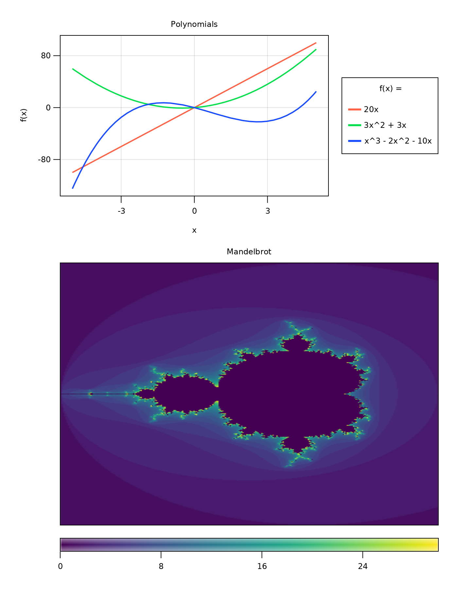

# Summary

`Makie.jl` is a cross-platform plotting ecosystem for the Julia programming language, which enables researchers to create high-performance, GPU-powered, interactive visualizations, as well as publication-quality vector graphics with one unified interface.
The infrastructure based on `Observables.jl` allows users to express how a visualization depends on multiple parameters and data sources, which can then be updated live, either programmatically, or through sliders, buttons and other GUI elements.
A sophisticated layout system makes it easy to assemble complex figures.
It is designed to avoid common difficulties when aligning nested subplots of different sizes, or placing colorbars or legends freely without spacing issues.
`Makie.jl` leverages the Julia type system to automatically convert many kinds of input arguments which results in a very flexible API that reduces the need to manually prepare data.
Finally, users can extend every step of this pipeline for their custom types through Julia's powerful multiple dispatch mechanism, making Makie a highly productive and generic visualization system.

# Statement of need

Good data visualization is crucial for the work of every scientist around the world.
To effectively understand and communicate results, different disciplines ranging from publication-quality static vector graphics, through animated movies, to interactive data exploration tools, require flexible and powerful plotting software.
Most tools available today lack one or more of the following attributes: High performance for the fluid rendering of large datasets, interactive visualizations, the ability to extend the plotting pipeline to handle user-defined data structures and types, implementations of both 2D and 3D rendering, and the power to construct complex figures without having to tweak alignments and spacings after the fact in image editing software.
Therefore, researchers have to switch between tools which means they have to spend more time to learn unfamiliar syntax and redo work if one software turns out to lack critical abilities for the task at hand.

`Makie.jl` is a new plotting package which is built from the ground up to leverage the power of `Julia`, a relatively young programming language which excels at technical computing and has seen steady growth of its user base since reaching the 1.0 milestone in 2018.
Julia users have historically often used plotting software from other ecosystems, such as `matplotlib` or `ggplot` through `PyCall.jl` and `RCall.jl`.
But these wrapper packages cannot take full advantage of Julia's type system and multiple dispatch paradigm, so they leave both performance and flexibility on the table.
`Makie.jl` aims to fill this gap in the Julia ecosystem.

# Example

The following example illustrates a few key features of `Makie.jl`:
Both plots use Julia's multiple dispatch to visualize functions directly over given intervals or ranges.
The layout is non-trivial, as a legend is placed above the left axis, which conforms to its width automatically, while both are aligned with the right axis and its colorbar placed below.
The figure title is added not with a specialized function, but via the ordinary layout mechanism.

```julia
using CairoMakie

polynomials = ["20x", "3x^2 + 3x", "x^3 - 2x^2 - 10x"]
functions = eval.(Meta.parse.("x -> " .* polynomials))

f = Figure(resolution = (700, 500), fontsize = 14, font = "Helvetica")
ax = Axis(f[2, 1], xlabel = "x", ylabel = "f(x)", title = "Polynomials")

colors = [:tomato, "#04e04c", RGBf0(0.1, 0.3, 1)]

for (f, p, color) in zip(functions, polynomials, colors)
    lines!(-5..5, f, label = p, color = color, linewidth = 2)
end

Legend(f[1, 1], ax, orientation = :horizontal, colgap = 20, tellheight = true)

function mandelbrot(x, y)
    z = c = x + y*im
    for i in 1:30.0; abs(z) > 2 && return i; z = z^2 + c; end
    return 0.0
end

ax2, hm = heatmap(f[1:2, 2][1, 1], -2:0.01:1, -2:0.01:2, mandelbrot,
    interpolate = true, colormap = :thermal)
hidedecorations!(ax2)
Colorbar(f[1:2, 2][2, 1], hm, height = 20, vertical = false,
    flipaxis = false, label = "Iterations")

Label(f[0, :], "Makie.jl Example Figure")

save("paper_example.png", f, px_per_unit = 2)
```



# Overview


# Acknowledgements

We acknowledge contributions from ...

# References